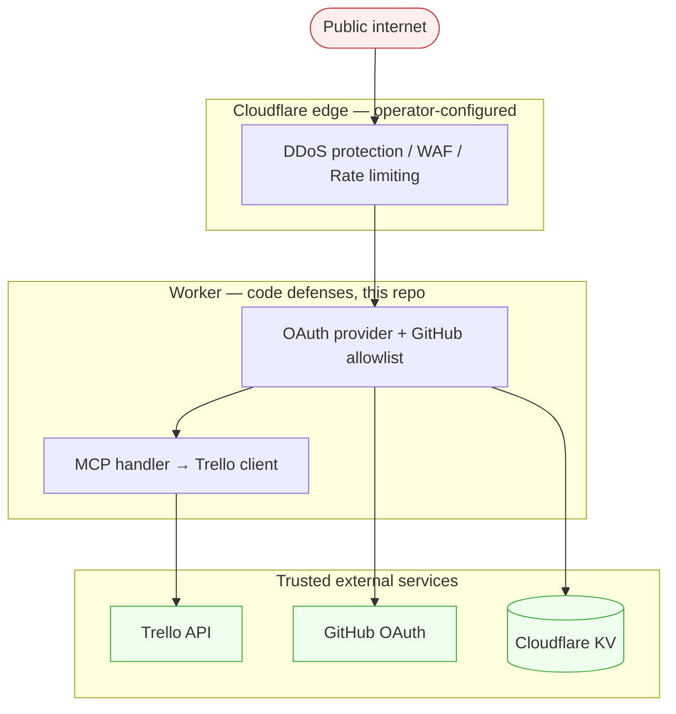

# Security

This document describes the security posture of the Trello MCP server: what
it defends against, what it doesn't, what's already implemented, and what
the operator needs to configure outside the codebase.

## Reporting a Vulnerability

This is a personal hobby project. If you find a vulnerability, open a private
security advisory on GitHub or contact the repo owner directly. Please do not
file public issues for sensitive findings.

---

## Threat Model

### Assets we protect

- **Trello API credentials** (API key + token) — give full access to all the
  operator's Trello boards.
- **GitHub OAuth client secret** — could be used to impersonate this app.
- **OAuth tokens issued to MCP clients** — give access to the MCP tool surface
  (which has full Trello access).
- **Cloudflare Worker compute & quota** — abuse can incur cost or push past
  free-tier limits, causing denial-of-service.
- **OAuth state in KV** — abuse can poison KV writes / consume quota.

### Adversary model

- **In scope**: opportunistic attackers scanning the public internet,
  scripted abuse, automated bots, casual reverse-engineering of the public
  GitHub repo, OAuth misuse / token theft via XSS-equivalents in client tooling.
- **Not in scope**: nation-state attackers, sophisticated targeted attacks,
  supply-chain attacks against npm dependencies (best-effort mitigation only),
  attacks that require physical access to the operator's machine.

### Trust boundaries



A compromise of the operator's Cloudflare account, GitHub account, or local
machine (where `.dev.vars` lives) is out of scope — those are root trust.

---

## Defenses Implemented in Code

These are enforced by the worker on every request and require no operator
configuration beyond setting the documented secrets.

### Authentication

- **OAuth 2.1 with PKCE S256** — plain PKCE is rejected
  (`allowPlainPKCE: false`).
- **Implicit flow disabled** — library default; we don't override it.
- **MCP endpoint requires a valid bearer token** — unauthenticated requests
  to `/mcp` get 401 from the OAuth provider library.

### Authorization

- **GitHub username allowlist** — `ALLOWED_USERS` is a comma-separated list of
  GitHub logins. Only those users can complete the GitHub login flow.
- **Fail-closed** — if `ALLOWED_USERS` is unset or empty, the worker rejects
  all logins with HTTP 503 and logs `OAuth callback rejected: ALLOWED_USERS is
  empty or unset`. There is no "allow everyone" mode.

### Token lifecycle

- **Access tokens expire in 1 hour** (`accessTokenTTL: 3600`).
- **Refresh tokens expire in 30 days** (`refreshTokenTTL: 2592000`). The
  library default is "never" — we override this explicitly.

### OAuth client registration

- **Public Dynamic Client Registration is disabled**
  (`disallowPublicClientRegistration: true`). Anonymous requests to `/register`
  are rejected. Existing client registrations in KV are unaffected.
- **Implication**: connecting a fresh `mcp-remote` against an empty KV
  namespace will fail. To bootstrap a new install, temporarily flip the flag
  off in `src/index.ts`, register the client, then re-enable. Or pre-register
  via `OAuthHelpers.createClient()` in code.

### Credential handling

- **Trello API key + token** are sent to Trello via the `Authorization` header
  using Trello's `OAuth oauth_consumer_key="...", oauth_token="..."` header
  format (key + token only — not a signed OAuth 1.0a request, no signature,
  no nonce, no timestamp). They never appear in URL query strings, request
  bodies, or response bodies.
- **All secrets** are stored as
  [Cloudflare Worker secrets](https://developers.cloudflare.com/workers/configuration/secrets/)
  (encrypted at rest, never in source).
- **`.dev.vars`** (local dev) is git-ignored and never committed. Verified
  in git history.

### Per-request isolation

- A new `TrelloClient` is created per request. The mutable `activeBoardId` /
  `activeWorkspaceId` state on the client is therefore scoped to a single
  request and cannot leak across users.
- Workers V8 isolate reuse does not affect this because the client is
  instantiated inside `apiHandler.fetch`, not at module scope.

### Error sanitization

- Trello upstream error response bodies are **not returned** to the MCP
  client. Errors surface as `Trello API error (status NNN)` with no body.
- Full error bodies are logged via `console.error` and visible through
  `wrangler tail` for debugging.

### Supply-chain hygiene

- **Pinned dependencies** — exact versions for all production dependencies
  except `@cloudflare/workers-oauth-provider` (caret-pinned, tracked in
  the roadmap). Some dev-dependencies (e.g. `vitest`) also use caret
  pinning; lower-risk since they don't ship to production.
- **Lockfile enforcement** — `npm ci` + `.npmrc` with `package-lock=true`.
- **No install scripts** — `.npmrc` sets `ignore-scripts=true` to block
  malicious postinstall hooks.

---

## Defenses the Operator Must Configure

These live outside the codebase and require Cloudflare dashboard or `wrangler`
actions. None require a paid Cloudflare plan.

### Always on, no action required

- **Layer 3/4 DDoS protection** — automatic on all Cloudflare-fronted traffic.
- **Layer 7 HTTP DDoS protection** — automatic; sensitivity tunable in
  Security → DDoS.

### Recommended: Rate Limiting Rule (1 free per zone)

Free plan provides 1 rate-limiting rule. Apply it to the most abusable
endpoint. With public DCR disabled, that's still `/register` (it will reject
fast, but we don't want it hammered).

```
Field:  http.request.uri.path equals "/register"
Period: 10 seconds
Threshold: 5 requests
Action: Block
```

If you re-enable public DCR, this rule becomes more important. Alternatives
worth considering: limit `/authorize` (5 req/10s) or `/token` (10 req/10s).

### Recommended: WAF Custom Rules (up to 5 free)

Apply restrictions only to **browser-driven endpoints** (`/authorize`,
`/callback`). Do **not** apply bot challenges to `/mcp` — see "DO NOT enable"
below for why.

Suggested rules:

1. **Geo-restrict the browser flow** to your residence country:
   ```
   (http.request.uri.path in {"/authorize" "/callback"} and ip.geoip.country ne "LU")
   → Managed Challenge
   ```
   Replace `LU` with your country code.

2. **Block `/register` outright** (if public DCR is disabled and you don't
   need it):
   ```
   (http.request.uri.path eq "/register")
   → Block
   ```

3. **Reserve remaining 3 rules** for incident response.

### Recommended: Workers Rate Limiting API (free, in-worker)

This is the right tool for limiting `/mcp` itself, since WAF bot
challenges would break MCP clients (see below). Requires Wrangler 4.36.0+.
Add to `wrangler.toml`:

```toml
[[ratelimits]]
name = "MCP_RATE_LIMIT"
namespace_id = "1001"  # any positive integer string, unique per account

[ratelimits.simple]
limit = 60          # max calls to limit() per period, per Cloudflare location
period = 60         # window in seconds — must be 10 or 60
```

Then in your handler, call `await env.MCP_RATE_LIMIT.limit({ key })` and
return 429 if `success` is `false`.

**Choosing the key matters.** Cloudflare's docs explicitly warn against
keying on IP address (shared by users on mobile networks, corporate NATs,
privacy proxies). For this worker:

- On `/mcp`: key on the **authenticated user's GitHub login**
  (available in `props.login` from the OAuth flow). One MCP user can't be
  rate-limited by another user's traffic, and you avoid penalising shared
  IPs.
- On `/authorize` and `/callback` (unauthenticated): the only signal you
  have is the IP. Use `cf-connecting-ip` here as a fallback, accepting the
  shared-IP false-positive risk on these low-frequency browser flows.

Not yet wired up in code — see the Day 2 roadmap.

Reference: [Cloudflare Rate Limiting binding docs](https://developers.cloudflare.com/workers/runtime-apis/bindings/rate-limit/).

### DO NOT enable: Bot Fight Mode

Cloudflare's free **Bot Fight Mode** (Security → Bots → Bot Fight Mode) issues
JavaScript challenges to traffic it classifies as automated. This **will
break MCP**:

- `mcp-remote` is a Node.js CLI; it sends a Node user-agent and uses plain
  `fetch()`.
- Cloudflare classifies it as automated → JS challenge.
- `mcp-remote` has no DOM / no browser engine → cannot solve the challenge.
- Result: every MCP call fails.

The same is true of any "Super Bot Fight Mode" rule that challenges
non-verified bots without an allowlist for your specific client (paid plans
only).

**Use Workers Rate Limiting and WAF custom rules scoped to browser endpoints
instead.** They achieve similar goals without breaking the API surface.

---

## Operator Responsibilities

Things the worker can't do for you:

- **Rotate Trello credentials periodically** — the API key and token in
  Wrangler secrets give full access to the operator's Trello account. Rotate
  every 6–12 months or after any suspected exposure.
- **Rotate the GitHub OAuth client secret** — same cadence.
- **Maintain the allowlist** — remove inactive users from `ALLOWED_USERS`.
  Note: removing a user does **not** revoke their existing access tokens
  (those keep working for up to 1h, refresh tokens for up to 30 days).
- **Monitor Worker invocations** — Cloudflare dashboard → Workers → your
  worker → Logs / Metrics. Free tier retains a few days. Watch for 503s
  (allowlist misconfiguration), 401s (token issues), and unexpected traffic
  spikes.
- **Tail logs during issues** — `wrangler tail` shows `console.error` output
  in real time, including sanitized Trello upstream errors.
- **Review the public GitHub repo** — keep `.dev.vars`, `node_modules/`,
  `.wrangler/` in `.gitignore`. Review every commit before pushing for
  accidentally-included secrets.

---

## Known Limitations / Roadmap

These are honest gaps in the current implementation. They were identified in
the security audit but deferred from "Day 1" because they require more
work or design discussion. Listed in roughly decreasing priority.

### High priority (Day 2)

- **No incoming rate limit at the worker.** A burst of unauthenticated
  requests to `/authorize` / `/token` / `/register` / `/mcp` will burn through
  Worker quotas and KV writes. Mitigated partially by the recommended
  Cloudflare configuration above; the in-worker piece (Workers Rate Limiting
  binding) is not yet implemented.
- **In-worker rate limiter to Trello is per-request and effectively a no-op.**
  `src/rate-limiter.ts` exists but each `TrelloClient` gets a fresh token
  bucket. Cross-request rate limiting requires Durable Objects or a KV
  counter.
- **No `fetch` timeouts on outgoing calls** to Trello or GitHub. A hung
  upstream burns CPU budget on the worker. Should wrap with `AbortController`.
- **No size limits on `attach_image_data_to_card`.** The Zod schema is
  `z.string()` with no `.max()`. A 100MB base64 payload could OOM the worker.
- **Zod input schemas have no length / format constraints.** Trello IDs
  should be `z.string().regex(/^[a-f0-9]{24}$/)`; free-text fields should
  have `.max(N)`. Today, garbage input is forwarded to Trello, wasting a
  round trip.

### Medium priority

- **Allowlist is checked only at login time.** Removing a user from
  `ALLOWED_USERS` does not revoke existing tokens. A per-request re-check
  would close this gap.
- **`getCard` always fetches the full card payload** (attachments, members,
  100 comments, all checklists). Should be opt-in via a `detail` parameter.
- **No structured logging.** Only error paths log via `console.error`. Auth
  attempts, allowlist denials, and tool calls should also log so anomalies
  are visible.
- **`mcpJson` pretty-prints every response.** Wastes egress bytes and LLM
  input tokens.

### Low priority

- **`@cloudflare/workers-oauth-provider` uses caret pinning** in
  `package.json`. All other deps are exact-pinned.
- **Pre-existing TS2322 typecheck error** in `src/index.ts:42`: the `Env`
  type doesn't declare `OAUTH_PROVIDER` which the OAuth library injects.
- **Tool registration runs on every request** in `createServer(env)` instead
  of being hoisted to module scope. Adds 5–15 ms per request.

### Won't fix

- **Trello account-level access via API token.** The Trello token model is
  account-wide; there's no scoped token type to limit which boards this
  worker can touch. If you don't trust the worker, don't deploy it.
- **No defense against the operator's Cloudflare/GitHub/Trello account being
  compromised.** Out of scope.
